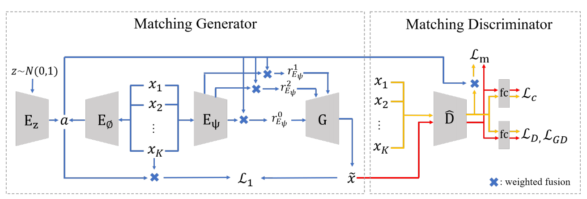
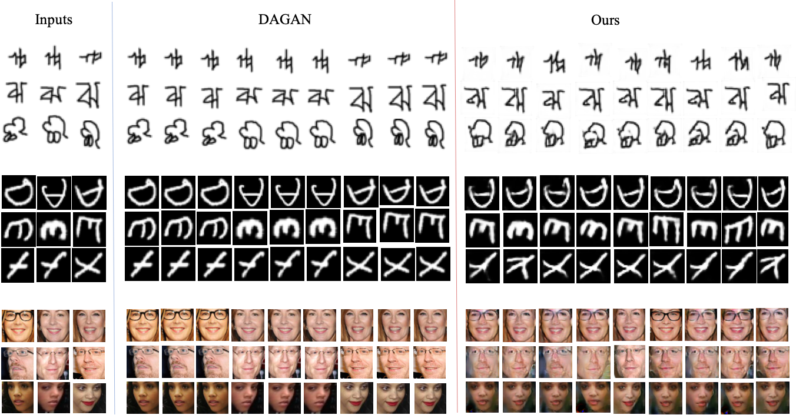
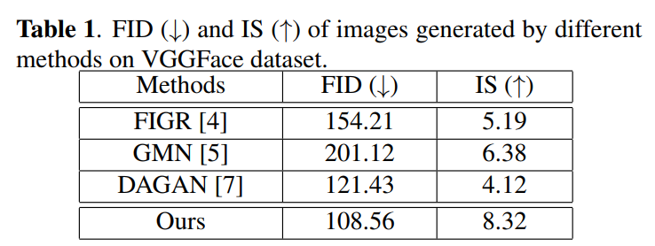
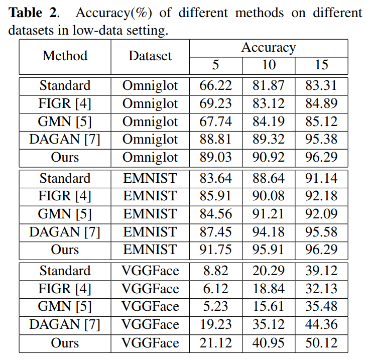
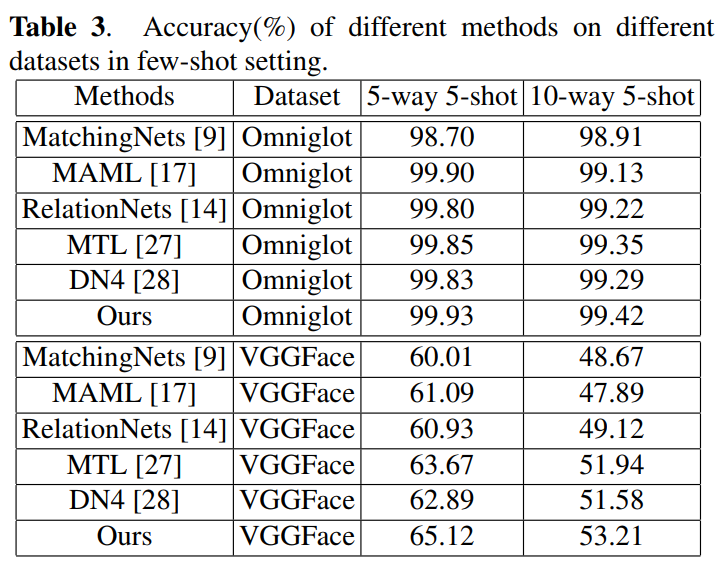

# Matchinggan: Matching-Based Few-Shot Image Generation

Code for our **ICME 2020** paper *"Matchinggan: Matching-Based Few-Shot Image Generation"*.

Created by [Yan Hong](https://github.com/hy-zpg),  [Li Niu\*](https://github.com/ustcnewly), Jianfu Zhang, Liqing Zhang.

Paper Link: [[arXiv]](https://arxiv.org/pdf/2003.03497.pdf)


## Citation

If you find our work useful in your research, please consider citing:

```
@inproceedings{hong2020matchinggan,
  title={Matchinggan: Matching-Based Few-Shot Image Generation},
  author={Hong, Yan and Niu, Li and Zhang, Jianfu and Zhang, Liqing},
  booktitle={2020 IEEE International Conference on Multimedia and Expo (ICME)},
  pages={1--6},
  year={2020},
  organization={IEEE}
}
```

## Introduction

Few-shot image generation aims at generating images for a new category with only a few images, which can make fast adaptation to a new category especially for those newly emerging categories or long-tail categories, and benefit a wide range of downstream category-aware tasks like few-shot classification. In this paper, MatchingGAN is proposed to fully exploit multiple conditional images from the same category to generate more diverse and realistic images by virtue of the combination of adversarial learning and matching procedure. In detail, our MatchingGAN is comprised of a matching generator and a matching discriminator. In the matching generator, we project a random vector and a few conditional images from one seen category into a common matching space, and calculate the similarity scores, which are used as interpolation coefficients to fuse features of conditional images to generate new images belonging to this seen category. In the matching discriminator, we not only distinguish real images from fake images as done by conventional GAN discriminator, but also match the discriminative feature of generated image with the fused discriminative feature of conditional images to ensure that the generated image contains the interpolated information of conditional images.




## Visualization 

More generated reuslts to view [here](https://arxiv.org/pdf/2008.01999.pdf)


## Experiments

### Hardware& Software Dependency

- **Hardware** 
    
  a single GPU or multiple GPUs
  
- **Software** 

  Tensorflow-gpu (version >= 1.7)
  
  Opencv
  
  scipy  
  
- Click [here](https://github.com/bcmi/F2GAN-Few-Shot-Image-Generation/three/main/requirements.txt) to view detailed software dependency            
  

### Datasets Preparation 
* The Download links can be found [here](https://github.com/bcmi/Awesome-Few-Shot-Image-Generation#Datasets)
- **Omniglot**
    
  Categories/Samples: 1412/ 32460
  
  Split: 1200 seen classes, 212 unseen classes
 
- **Emnist**

  Categories/Samples: 38/ 106400
  
  Split: 28 seen classes, 10 unseen classes
  
  
- **VGGFace**

  Categories/Samples: 2299/ 229900
  
  Split: 1802 seen classes, 497 unseen classes
  
  
  
### Baselines

#### Few-shot Image Generation

* FIGR: Few-shot Image Generation with Reptile [paper](http://proceedings.mlr.press/v84/bartunov18a/bartunov18a.pdf)  [code](https://github.com/sbos/gmn)

* Few-shot Generative Modelling with Generative Matching Networks [paper](http://proceedings.mlr.press/v84/bartunov18a/bartunov18a.pdf)  [code](https://github.com/sbos/gmn)


* Data Augmentation Generative Adversarial Networks [paper](https://arxiv.org/pdf/1711.04340)  [code](https://github.com/AntreasAntoniou/DAGAN)

#### Few-shot Image Classification
* Matching Networks for One Shot Learning [paper](https://arxiv.org/pdf/1606.04080.pdf)  [code](https://github.com/AntreasAntoniou/MatchingNetworks)

* Model-Agnostic Meta-Learning for Fast Adaptation of Deep Networks [paper](https://arxiv.org/pdf/1703.03400.pdf)  [code](https://github.com/cbfinn/maml)

* Learning to Compare: Relation Network for Few-Shot Learning [paper](https://arxiv.org/pdf/1711.06025.pdf)  [code](https://github.com/floodsung/LearningToCompare_FSL)


* Meta-Transfer Learning for Few-Shot Learning [paper](https://openaccess.thecvf.com/content_CVPR_2019/papers/Sun_Meta-Transfer_Learning_for_Few-Shot_Learning_CVPR_2019_paper.pdf)  [code](https://github.com/y2l/meta-transfer-learning-tensorflow)

* Cross-Domain Few-Shot Classification via Learned Feature-Wise Transformation [paper](https://arxiv.org/pdf/2001.08735.pdf)  [code](https://github.com/y2l/meta-transfer-learning-tensorflow)


### Getting Started

### Installation

1.Clone this repository.

```
git clone https://github.com/bcmi/MatchingGAN-Few-Shot-Image-Generation.git
```

2.Create python environment for *MatchingGAN* via pip.

```
pip install -r requirements.txt
```


### Trained Model

COMING SOON !

### Training

1.Train on Omniglot dataset

```
python train_dagan_with_matchingclassifier.py --dataset omniglot --image_width 28 --batch_size 20  --experiment_title ICMEMatchingGAN/omniglot1way3shot   --selected_classes 1 --support_number 3  --loss_G 1 --loss_D 1 --loss_CLA 1  --loss_recons_B 0.1 --loss_matching_D 1  
```

2.Train on EMNIST dataset

```
python train_dagan_with_matchingclassifier.py --dataset emnist --image_width 28 --batch_size 20  --experiment_title ICMEMatchingGAN/emnist1way3shot   --selected_classes 1 --support_number 3  --loss_G 1 --loss_D 1 --loss_CLA 1  --loss_recons_B 0.1 --loss_matching_D 1  
```

3.Train on VGGFce dataset

```
python train_dagan_with_matchingclassifier.py --dataset vggface --image_width 28 --batch_size 20  --experiment_title ICMEMatchingGAN/vggface1way3shot   --selected_classes 1 --support_number 3  --loss_G 1 --loss_D 1 --loss_CLA 1  --loss_recons_B 0.1 --loss_matching_D 1   
```


### Trained Model
COMING SOON


### Evaluation from three aspects including GAN metrics, low-data classification, and few-shot classification.

#### 1. Visualizing the generated images based on trained models, the generated images are stored in the path '--experiment_title'

**Omniglot generated images**
```
python test_dagan_with_matchingclassifier_for_generation.py  --is_training 0 --is_all_test_categories 1 --is_generation_for_classifier 1  --general_classification_samples 10 --dataset omniglot --image_width 28  --batch_size 30  --num_generations 128 --experiment_title EVALUATION_Augmented_omniglot_ICME --selected_classes 1 --support_number 3   --restore_path path ./trained_models/omniglot/ --continue_from_epoch 100
```

**EMNIST generated images**
```
python test_dagan_with_matchingclassifier_for_generation.py  --is_training 0 --is_all_test_categories 1 --is_generation_for_classifier 1  --general_classification_samples 10 --dataset emnist --image_width 28  --batch_size 30  --num_generations 128 --experiment_title EVALUATION_Augmented_emnist_ICME --selected_classes 1 --support_number 3   --restore_path   ./trained_models/emnist/  --continue_from_epoch 100
```

**VGGFace generated images**

```
python test_dagan_with_matchingclassifier_for_generation.py  --is_training 0 --is_all_test_categories 1 --is_generation_for_classifier 1  --general_classification_samples 10 --dataset vggface --image_width 96  --batch_size 30  --num_generations 128 --experiment_title EVALUATION_Augmented_vggface_ICME --selected_classes 1 --support_number 3   --restore_path  path  ./trained_models/vggface/  --continue_from_epoch 100
```


#### 2. Testing the GAN metrics including IS, FID, and IPIPS for generated images, which is suitable for RGB 3-channel images like VGGFace, Flowers, and Animal Faces datasets.


**VGGFace GAN metrics**


```
python GAN_metrcis_FID_IS_LPIPS.py  --dataroot_real ./EVALUATION/Augmented/vggface/ICME/visual_outputs_realimages/ --dataroot_fake  ./EVALUATION/Augmented/vggface/ICME/visual_outputs_forquality/  --image_width 128 --image_channel 3 --augmented_support 100  --dir ./EVALUATION/Augmented/vggface/ICME/visual_outputs_forquality/ --out ./EVALUATION/Augmented/vggface/ICME/GAN_METRICS.txt 

```


#### 3. Testing the classification in low-data setting with augmented images.
take Omniglot as example, low-data classification with augmented images generated from our trained model

3.1. Gnerating augmented images using three conditional images
```
python test_dagan_with_matchingclassifier_for_generation.py  --is_training 0 --is_all_test_categories 1 --is_generation_for_classifier 1  --general_classification_samples 10 --dataset omniglot --image_width 96  --batch_size 30  --num_generations 512 --experiment_title EVALUATION_Augmented_omniglot_ICME --selected_classes 1 --support_number 3   --restore_path path ./trained_models/omniglot/ --continue_from_epoch 100
```

3.2. Preparing generated images: the generated images are stored in the 'storepath/visual_outputs_forclassifier' and setting the storepath for preprocessed data, running below script

```
python data_preparation.py --dataroot storepath/visual_outputs_forclassifier  --storepath --image_width 28 --channel 1 
```
3.3. Replacing the datapath in data_with_matchingclassifier_for_quality_and_classifier.py with the storepath for preprocessed data.

3.4. Running the script for low-data classification.

```
train_classifier_with_augmented_images.py --dataset omniglot  --selected_classes testing_categories  --batch_size 16 --classification_total_epoch 50  --experiment_title AugmentedLowdataClassifier_omniglot  --image_width 28  --image_height 28 --image_channel 1
```
--selected_classes: the number of total testing categories


#### 4. Testing the classification in few-shot setting with augmented images.
take Omniglot as example, NwayKshot classification with augmented images generated from our trained model

4.1. Gnerating augmented images using Kshot conditional images
```
python test_dagan_with_matchingclassifier_for_generation.py  --is_training 0 --is_all_test_categories 1 --is_generation_for_classifier 1  --general_classification_samples 10 --dataset omniglot --image_width 28  --batch_size 30  --num_generations 128 --experiment_title EVALUATION_Augmented_omniglot_ICME --selected_classes 1 --support_number K   --restore_path path ./trained_models/omniglot/ --continue_from_epoch 100
```
setting the '--support_number' as K.

4.2. Preprocessing the generated images
```
python data_preparation.py --dataroot ./EVALUATION/Augmented/omniglot/ICME/visual_outputs_forclassifier  --storepath ./EVALUATION/Augmented/omniglot/ICME/  --image_width 28 --channel 1 
```

4.3. Replacing the datapath in data_with_matchingclassifier_for_quality_and_classifier.py with ./EVALUATION/Augmented/omniglot/ICME/omniglot.npy.

4.4. Running the script for few-shot classification.

```
train_classifier_with_augmented_images.py --dataset omniglot  --selected_classes N  --batch_size 16 --classification_total_epoch 50  --experiment_title AugmentedFewshotClassifier_  --image_width 28  --image_height 28 --image_channel 1
```
setting the '--selected_classes' as N.


### Results

#### GAN metrics of Generated Images




#### Low-data Image Classification




#### Few-shot Image Classification




## Acknowledgement

Some of the codes are built upon [DAGAN](https://github.com/AntreasAntoniou/DAGAN). Thanks them for their great work!

If you get any problems or if you find any bugs, don't hesitate to comment on GitHub or make a pull request!

*F2GAN* is freely available for non-commercial use, and may be redistributed under these conditions. For commercial queries, please drop an e-mail. We will send the detail agreement to you.


